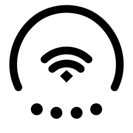

# DuoIcon

<p align="center">
  
</p>

배터리, Wi-Fi, 음량 상태를 하나의 아이콘으로 보여주는 macOS 전용 메뉴바 앱입니다.

## 주요 기능

- 상단 아치로 배터리 잔량 표시
- 배터리 10% 이하에서 아치를 빨간색으로 표시
- 전원 어댑터 연결 시 아치 오른쪽 끝에 초록색 점 표시
- 중앙에 macOS Wi-Fi 심볼 표시, 연결이 끊기면 슬래시 표시
- 하단 점 4개로 음량을 25% 단위로 표시, 음소거 시 모두 비활성화
- 볼륨 키를 누르면 앱 아이콘 바로 아래에 음량 조절 박스 표시
- 배터리, Wi-Fi, 사운드 시스템 설정 바로가기 제공

## 상태 표시

| 영역 | 상태 | 표시 방식 |
| --- | --- | --- |
| 상단 아치 | 배터리 | 잔량에 비례해 왼쪽부터 채움 |
| 상단 아치 | 10% 이하 | 빨간색 |
| 아치 오른쪽 끝 | 전원 연결 | 초록색 점 |
| 중앙 | Wi-Fi 연결 | `wifi` 시스템 심볼 |
| 중앙 | Wi-Fi 미연결 | `wifi.slash` 시스템 심볼 |
| 중앙 | 음량 변경 | 2초 동안 스피커 시스템 심볼 |
| 중앙 | 배터리 10% 이하 진입 | 3초 동안 빨간 배터리 심볼 |
| 하단 점 | 음량 | 0~4개, 25% 단위 |

중앙 심볼은 180ms 동안 페이드 전환됩니다. macOS의 **동작 줄이기**가 활성화된 경우 애니메이션을 생략합니다. Wi-Fi 연결 해제는 일시적인 조회 실패로 인한 깜빡임을 막기 위해 1초 이상 지속될 때 반영합니다.

## 볼륨 키 HUD

볼륨 키와 음소거 키를 누르면 macOS 기본 HUD 대신 DuoIcon 아이콘 아래에 커스텀 음량 박스가 표시됩니다.

- 일반 조절 간격: `1/16`
- `Option + Shift` 조절 간격: `1/64`
- `Option + 볼륨 키`: macOS 사운드 설정 바로가기 동작 유지
- 마지막 조작 후 2.5초 뒤 자동 닫힘
- 마우스를 올리거나 슬라이더를 드래그하는 동안 열린 상태 유지
- 등장 180ms, 퇴장 140ms 페이드 애니메이션

볼륨 키를 가로채고 macOS 기본 HUD와 중복 표시되지 않게 하려면 손쉬운 사용 권한이 필요합니다.

1. 앱을 실행합니다.
2. **시스템 설정 → 개인정보 보호 및 보안 → 손쉬운 사용**으로 이동합니다.
3. **DuoIcon**을 허용합니다.

권한이 없거나 현재 출력 장치가 소프트웨어 음량 조절을 지원하지 않으면 볼륨 키는 macOS 기본 동작을 유지합니다. 개발용 ad-hoc 서명은 앱을 다시 빌드할 때 권한을 다시 허용해야 할 수 있습니다.

## 요구 사항

- macOS 13 Ventura 이상
- Apple Silicon 또는 Intel Mac
- 소스 빌드 시 Xcode Command Line Tools 또는 Xcode

## 빌드 및 실행

```bash
git clone https://github.com/olennis/duoicon.git
cd duoicon
sh build-app.sh
open "dist/DuoIcon.app"
```

앱은 Dock 아이콘 없이 메뉴바에서만 실행됩니다. 종료하려면 메뉴에서 **Quit DuoIcon**을 선택합니다.

`build-app.sh`는 릴리스 바이너리와 앱 아이콘을 생성하고 앱을 로컬 ad-hoc 방식으로 서명합니다. 다른 사용자에게 배포하려면 Apple Developer ID 서명과 notarization이 필요합니다.

## 테스트

```bash
swift run DuoIcon --self-test
```

다음 항목을 검사합니다.

- 음량 25% 경계값
- 배터리 저전력 및 충전 색상
- 중앙 알림 표시 시간과 우선순위
- 중단 가능한 심볼 전환과 동작 줄이기
- Wi-Fi 상태 안정화
- 볼륨 HUD 위치 및 렌더링

렌더링 결과는 `/tmp/duoicon-icons.png`와 `/tmp/duoicon-volume-hud.png`에 생성됩니다.

## 아이콘 리소스

<p align="center">
  
</p>

- `Assets/icon-source.png`: macOS 앱 아이콘 원본
- `Assets/AppIcon.icns`: 앱 번들에 포함되는 macOS 아이콘
- `Assets/favicon-source.svg`: 좌우 여백을 동일하게 맞춘 정사각형 favicon 원본
- `Assets/favicon.png`: 흰색 배경의 32×32 PNG favicon
- `Assets/favicon.ico`: 흰색 배경의 32×32 ICO favicon

favicon을 다시 생성하려면 릴리스 실행 파일을 빌드한 뒤 다음 명령을 실행합니다.

```bash
sh build-icons.sh
```

`build-app.sh`를 실행해도 favicon이 자동으로 다시 생성됩니다.

## 프로젝트 구조

```text
duoicon/
├── Assets/                  # 앱 아이콘 및 favicon 원본/산출물
├── Sources/DuoIcon/
│   ├── main.swift           # 상태 조회, 메뉴, 동적 메뉴바 아이콘
│   └── VolumeKeyHUD.swift   # 볼륨 키 감지 및 아이콘 하단 HUD
├── Info.plist
├── Package.swift
├── build-app.sh
└── build-icons.sh
```

## 알려진 제한 사항

- Wi-Fi 연결 상태는 네트워크 연결 여부이며 인터넷 접속 가능 여부를 의미하지 않습니다.
- 일부 외장 오디오 장치는 시스템 음량 속성을 제공하지 않아 음량이 0%로 표시되거나 슬라이더가 비활성화될 수 있습니다.
- 배터리가 없는 Mac에서는 배터리 아치가 비활성 상태로 표시됩니다.

## 라이선스

별도 라이선스가 추가되기 전까지 모든 권리는 저장소 소유자에게 있습니다.
